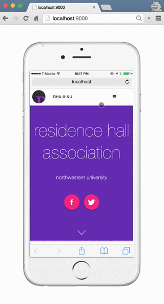

# Mobile Video Demo Template

This is a website template to display an app recording inside an iPhone 6.

#### Getting Started

1. `git clone git@github.com:sbolel/app-video-demo-html.git` - clone this repository and `cd` into it

2. `npm install` - install dependencies

3. Replace ./www/sample-demo.mov with your own screen recording

4. `grunt` - Serve the website in Google Chrome using Grunt and see the demo

#### Capturing Demo Video

* The background image is of an iPhone 6
    - Video dimensions should be near 375x667 or 748×1108
* To capture a mobile demo video of a web app on OS X,
    - Use [Chrome DevTools to emulate an iPhone 6](https://developers.google.com/web/tools/setup/device-testing/devtools-emulator).
    - Use [QuickTime Player to record the portion of the screen](https://support.apple.com/kb/PH5882?locale=en_US) that shows your web app.

#### Demo

